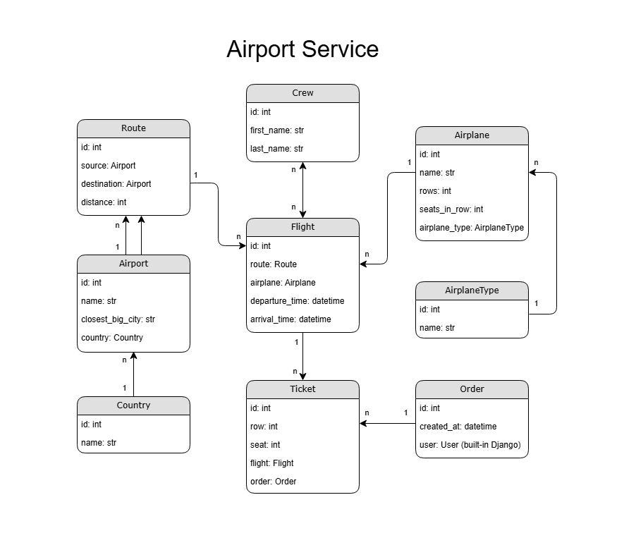
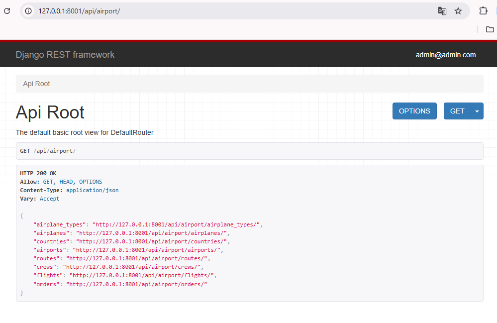
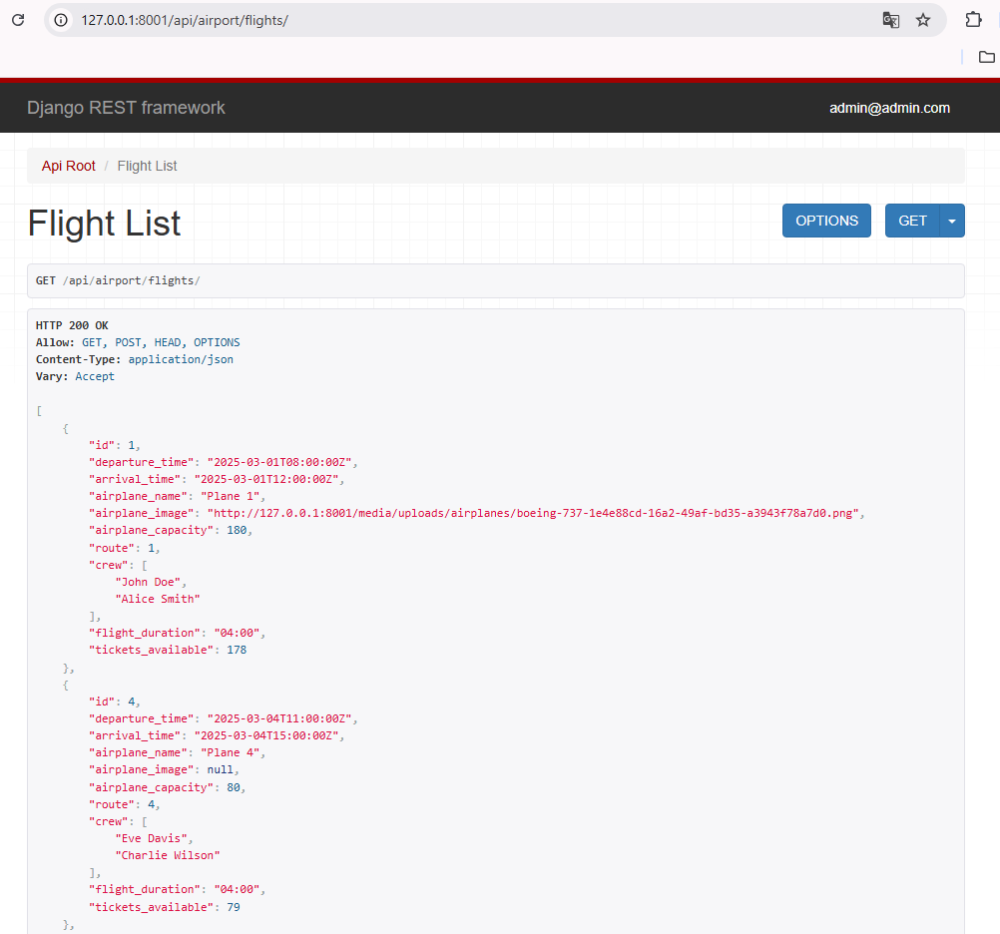
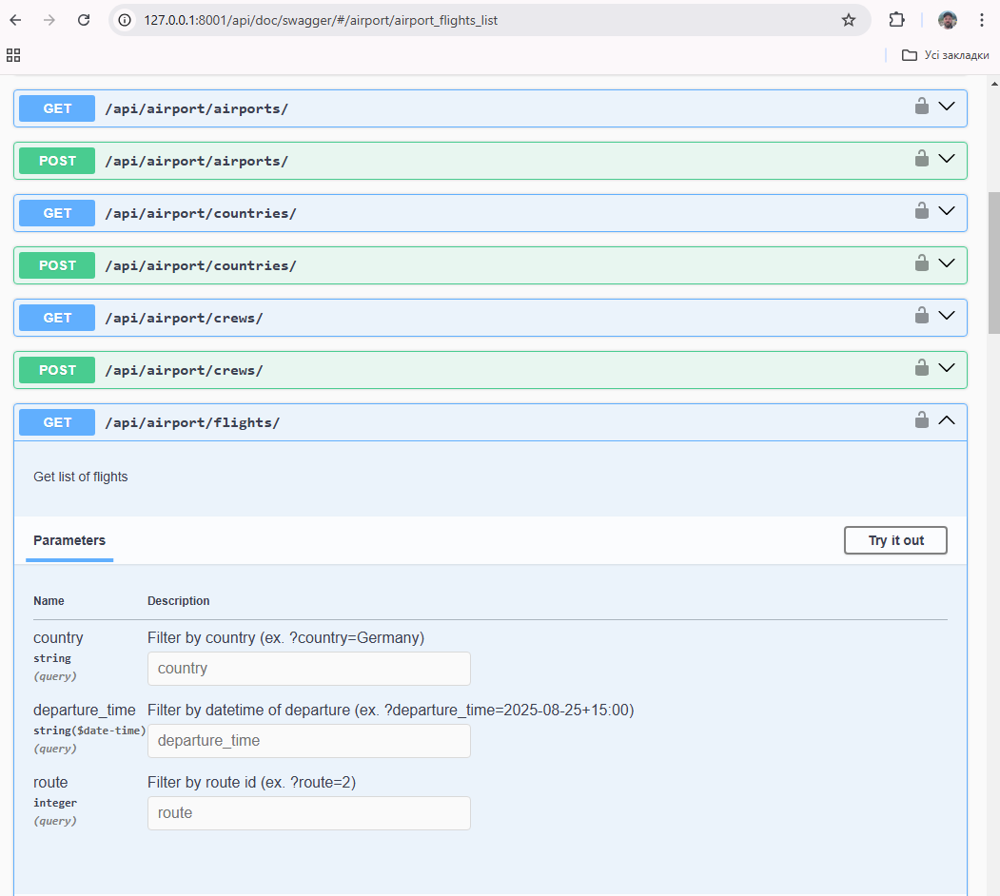

# Airport Service API

API service for managing ticket orders from airport, written on DRF

****

## Installing / Getting started


### Installing using GitHub

Clone the repository, navigate to the project directory,
create and activate a virtual environment, install the required dependencies:

```
git clone https://github.com/ruslanyemets/airport-service-api
cd airport-service-api
python3 -m venv venv
source venv/bin/activate  # For Linux/MacOS
venv\Scripts\activate  # For Windows
pip install -r requirements.txt
```

Set up environment variables by creating .env file in the root directory with the following content:

```env
DJANGO_SECRET_KEY=<your_secret_key>
DJANGO_SETTINGS_MODULE=airport_service.settings.local
```

Run database migrations, load data to database from JSON and start the development server:

```
python manage.py migrate
python manage.py loaddata airport_service_api_db_data.json
python manage.py runserver
```

Open your browser and go to http://127.0.0.1:8000/ to see the app in action.


### Run with docker

***Docker should be installed!***

Download image from Docker Hub repository:

https://hub.docker.com/repository/docker/ruslanyemets/airport-service-api/general

Create a `.env` file in the root directory and specify the environment variables:

```env
POSTGRES_PASSWORD=<db_password>
POSTGRES_USER=<db_user>
POSTGRES_DB=<db_name>
POSTGRES_HOST=<db_host>
POSTGRES_PORT=<db_port>
PGDATA=/var/lib/postgresql/data
DJANGO_SECRET_KEY=<your_secret_key>
DJANGO_SETTINGS_MODULE=airport_service.settings.docker
```

Launch containers:

```
docker-compose build
docker-compose up
```

Install fixture to try API with demo-data:

```docker-compose exec airport python manage.py loaddata airport_service_api_db_data.json```


****

## Usage

Once the server is running, you can access the application through your browser.
To log in use:
```
login: admin@admin.com
password: 12345
```

Or create superuser and use created username and password to log in:

```python manage.py createsuperuser``` - for local run

```docker-compose exec airport python manage.py createsuperuser``` - for run with docker


****

## Running Tests

To run tests for the application, use the following command:

```python manage.py test``` - for local run

```docker-compose exec airport python manage.py test``` - for run with docker


****

## Features

* JWT Authentication
* Managing orders and tickets for authenticated users
* Viewing and filtering functions in all endpoints for authenticated users
* Documentation is located at api/doc/swagger/ and api/doc/redoc/
* Most CRUD operations allowed only for admins


****

## Endpoints

* airport service via `api/airport/`
* user actions (register, login, profile) via `api/user/`
* documentation:
    -  swagger: `api/doc/swagger/`
    -  redoc: `api/doc/redoc/`

  
****

## Other notes about API

* Uploading image to specific airplane
* Search and filtering available on endpoints:
    -  `api/airport/routes`
    -  `api/airport/flights`
* Tickets can be created and viewed through Order endpoint only
* Ticket validation includes impossibility of booking one seat twice on the same flight
* Orders:
  -  for user: allowed only orders created by user
  -  for administrator: all orders can be viewed
* Quantity of seats in airplane for flight:
  -  in list view: total seats capacity and total available seats
  -  in detail view: taken places are shown
* Pagination realized for orders only


****

## Schema




****

## Demo




